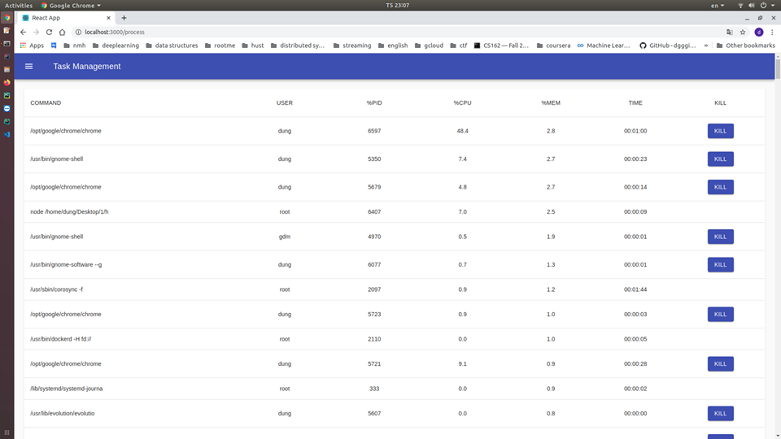

Open terminal in linux and run:
-       git clone https://github.com/matdieuhau999/taskmanagementfrontend.git

cd to taskmanagementfrontend: 
-       cd taskmanagementfrontend

Requier:
-       npm version >= 6 (https://linuxize.com/post/how-to-install-node-js-on-ubuntu-18.04/)
-       python 2.7 (sudo apt install python2)

Install environment:
        pip install flask 
        npm install
        
Run project:

        Open new terminal and run:    
        -       python app.py
                
                
                
                
        Open new terminal and run:    
        -       npm start
        
Open web browser and project run like this:

Click to pid to sort by pid increase.

Click to cpu to sort by %cpu used decrease.

Click to mem to sort by %mem used decrease.

Click kill to kill process

        
        
        

